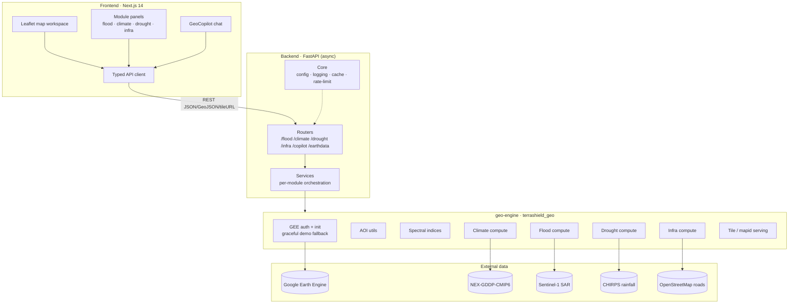
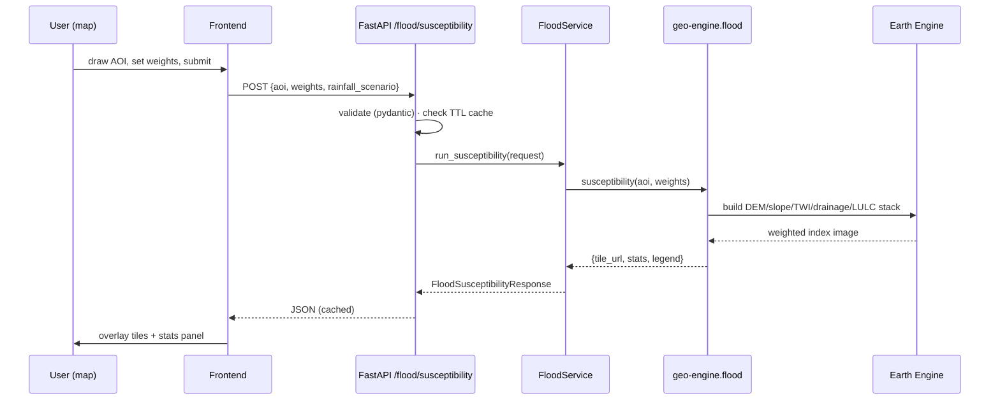
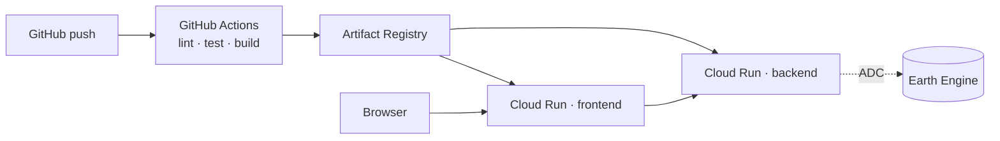

# TerraShield AI — Architecture

This document describes the system design: layers, data flow, and the contracts
between them. The north star is a clean separation between **compute**
(geo-engine), **orchestration** (backend), and **experience** (frontend), so any
module can grow independently.

## 1. Layered overview

## 2. Why these boundaries

| Boundary | Rule | Reason |
|----------|------|--------|
| frontend ↔ backend | Only typed REST. No GEE logic in the browser. | Keeps secrets server-side; lets us swap the UI or add a CLI/SDK client. |
| backend ↔ geo-engine | Backend imports the package; never calls GEE directly. | The compute library is reusable (notebooks, batch jobs, other apps) and independently testable. |
| geo-engine ↔ Earth Engine | A single `gee.init()` gateway with a **demo fallback**. | The whole stack runs offline for development and CI; live data is a config flip. |

## 3. Request lifecycle (FloodAI example)

## 4. Tile serving strategy

We do **not** ship GeoTIFFs to the browser. The geo-engine asks Earth Engine for
a `mapid`/tile-URL template for a styled `ee.Image`, and the backend returns that
URL. Leaflet then streams XYZ tiles directly from Google's edge. This is the same
proven pattern used in the `soil_prop` platform and keeps payloads tiny.

Vector results (flood extent polygons, inaccessible road segments) are returned
as **GeoJSON** with a size guard; large geometries are simplified server-side.

## 5. Cross-cutting concerns

- **Config** — `pydantic-settings`, env-driven, single `Settings` object.
- **Logging** — structured (JSON in prod, pretty in dev), request-id middleware.
- **Caching** — in-process TTL cache keyed by `(endpoint, normalized request)`;
  swappable for Redis in production. GEE calls are expensive — caching is not optional.
- **Rate limiting** — per-IP token bucket on compute endpoints.
- **Errors** — typed error envelope `{error, detail, hint}`; never leak GEE traces.

## 6. Deployment topology (target)

Single-region Cloud Run services, Earth Engine via Application Default
Credentials (no auth UI in prod), min-instances=1 to avoid cold starts on the
compute service. See [`infra/`](../infra) and the [roadmap](roadmap.md) Phase 5.
